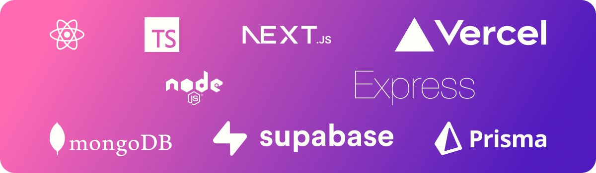

## Hello there, I'm Alexey Gusev 👋

[About me](#about)  
[Technology stack](#technologies)  
[Experience](#experience)  
[Contacts](#contacts)

### About me 

Long story short, I am a **web developer** residing in Mexico 🇲🇽 who is fond of gym, travelling and learning español. If you are interested, then a bit more about me.

I believe that creating useful and powerful applications is not just about routine tasks and technical knowledge but also involves a creative attitude, inspiration and real passion. These ideas are reflected in my current side project [_snipshot.dev_](https://snipshot.dev). It's an application for developers to store and share their favorite code snippets with others.

### Technology stack 

I am highly fascinated by the world of programming and development nowadays.  
Below are some of the technologies I usually use:

### Experience 

Besides the role of a developer, I also have a solid background as a project manager. During the past 5 years, I've participated in the development of several enterprise products in the banking sphere using agile methodologies. At the same time working as a financial risk manager made me understand that in our constantly evolving world the synergy of financials and technology is extremely powerful. Thus, I am trying to combine knowledge of both in my professional growth.

I am a self-taught developer and completed some courses:

### Contacts 

Do you want to get in touch? Here is my [UpWork profile](https://upwork.com/freelancers/~01a560d422b3a5df3e) and an e-mail: [gusev@snipshot.dev](mailto:gusev@snipshot.dev). Looking forward to hearing from you! 😉
