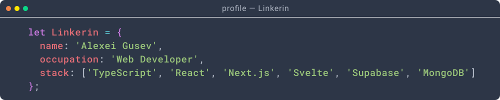

## Hello there, I'm Alexei Gusev 👋

- [About me](#about)
- [Technology stack](#technologies)
- [Experience](#experience)
- [Contacts](#contacts)

### About me 

Long story short, I am a **web developer** from Moldova 🇲🇩 residing in Mexico 🇲🇽
who is fond of gym, travelling and learning _español_. If you are interested,
then a bit more about me.

I believe that creating useful and powerful applications is not just about
routine tasks and technical knowledge but also involves a creative attitude,
inspiration and real passion. These ideas are reflected in my current side
project [**Limba Vie**](https://limba.ravenplan.com). It's a mobile web
application designed to help users learn Romanian words through fun and colorful
flashcards.

### Technology stack 

I am highly fascinated by the world of programming and development nowadays.  
Below are some of the technologies I usually use:

### Experience 

#### Projects:

- [Limba Vie](https://limba.ravenplan.com) - a mobile web application designed
  to help users learn Romanian words through fun and colorful flashcards.
- [starlight-to-pdf](https://github.com/Linkerin/starlight-to-pdf) - a
  command-line tool to convert Starlight documentation websites into PDF files.
- [Spectrum](https://spectrum.snipshot.dev) - a lightweight TypeScript library
  designed to simplify color manipulation and conversion tasks within the RGB,
  HSL, and HEX color spaces.
- [The Bachelor Recipe](https://recipes.snipshot.dev) - a SvelteKit-based
  website with tasty and easy cooking recipes.
- [snipshot](https://snipshot.dev) – an application for developers to store and
  share their favourite code snippets.
- [Raven Plan](https://github.com/Linkerin/raven-plan-demo) - a fancy and
  easy-to-use task management application.
- [Plunger dynamics tooling](https://plungerdynamics.com/tools/) - Django-based
  engineering tool for calculating plunger fall velocity.
- [LatestLeads](https://latestleads.co.uk) -
  [Companies House API](https://developer.company-information.service.gov.uk)
  (UK) data aggregation tool based on Express/MongoDB.
- [Accounting transactions analysis](https://github.com/Linkerin/transactions) -
  accounting transactions analysis tool developed for internal corporate needs.
  Based on [Flask](https://flask.palletsprojects.com) and
  [pandas](https://pandas.pydata.org).

Besides the role of a developer, I also have a solid background as a **project
manager**. During the past 5 years, I've participated in the development of
several enterprise products in the banking sphere using agile methodologies.  
At the same time working as a **financial risk manager** made me understand that
in our constantly evolving world the synergy of financials and technology is
extremely powerful. Thus, I am trying to combine knowledge of both in my
professional growth.

I make every effort to obtain high-quality knowledge:

### Contacts 

Do you want to get in touch? Here is my
[UpWork profile](https://upwork.com/freelancers/~01a560d422b3a5df3e) and an
e-mail address: [gusev@snipshot.dev](mailto:gusev@snipshot.dev). Looking forward
to hearing from you! 😉
